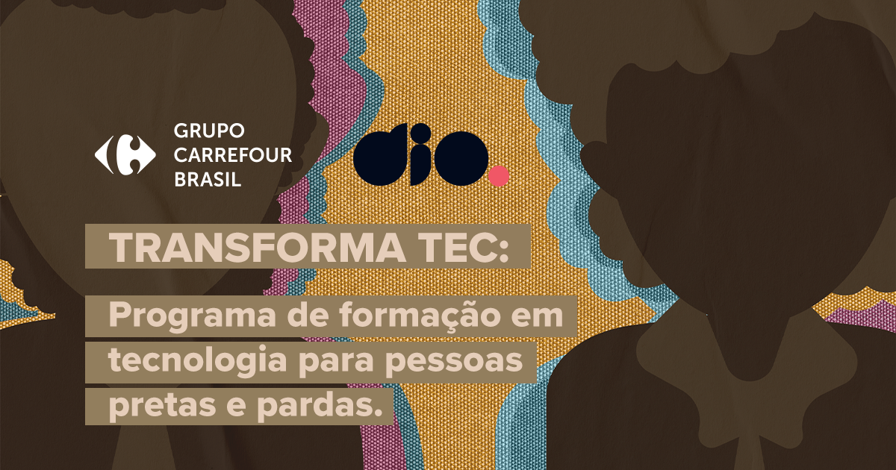

# :computer: Transforma Tec - 2022

Repositório de exercícios e desafios do Transforma Tec - 2022

:man_student:Turma: tarde (seg. a sex., das 14h às 16h)

:book: Período: 03/2022 - 10/2022 ( 8 meses)

:man_teacher:Professor: Cassiano Peres

### Transforma Tec

> O Transforma Tec é um programa de formação em tecnologia **100% gratuito** desenvolvido pelo Grupo Carrefour Brasil em parceria com a DIO.me.
>
> Todo o conteúdo do curso tem como base fundamentos do nível básico em desenvolvimento de software, com foco em desenvolvimento **Fullstack Java, React e Cloud**.
>
> Com estes aprendizados, os alunos são capacitados para trabalhar em todas etapas de projetos de desenvolvimento, sendo em banco de dados, servidor, armazenamento em nuvem e outros.
>
>  As aulas são diárias e **online** com 2 horas de duração. 
>
> #### Conteúdo Programático
>
> :one: Módulo Zero - Onboarding
>
> :two: Módulo I - Fundamentos
>
> :three: Módulo II - HTML e CSS
>
> :four: Módulo III - JavaScript
>
> :five: Módulo IV - React JS
>
> :six: Módulo V - Java
>
> :seven: Módulo VI - Banco de Dados SQL
>
> :eight: Módulo VII - Spring Boot
>
> :nine: Módulo VIII - Projeto FullStack: React + Spring Boot
>
> :keycap_ten: Módulo IX - Cloud
>
>  :hourglass:Carga horária: 420 horas

### Plataforma de estudo:

:link:[DIO - Digital Innovation One](https://www.dio.me/)

